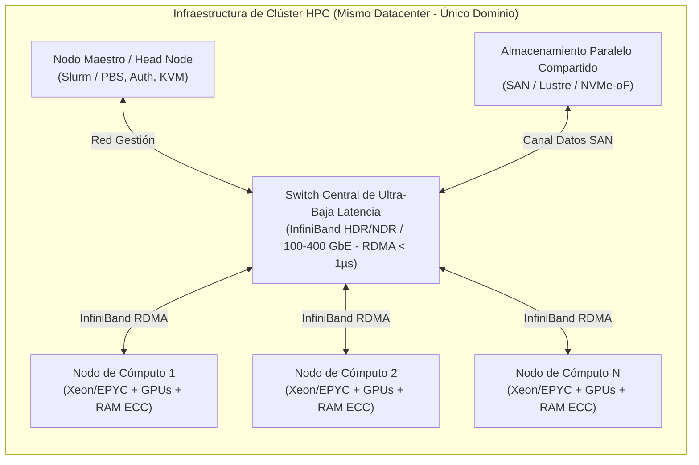
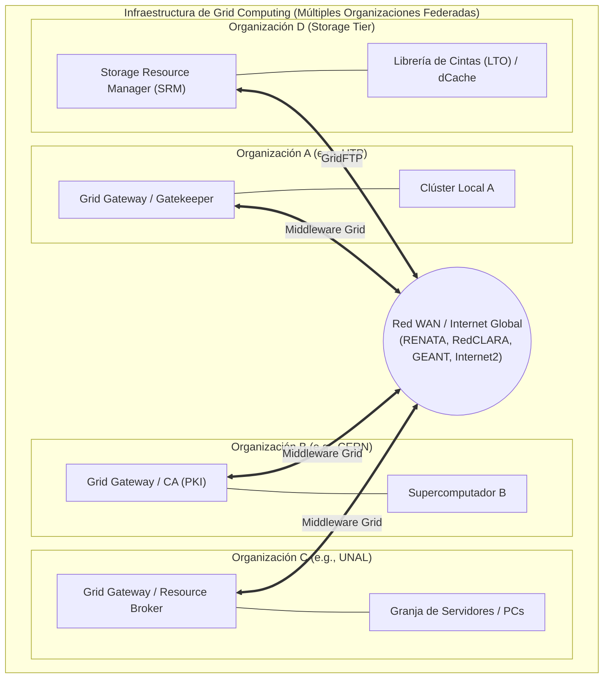

# Taller 1: Conceptos Clúster y Grid

* **Asignatura:** Sistemas Distribuidos (IS893)
* **Docente:** César Augusto Díaz Arriaga
* **Estudiante:** Yayo Gutiérrez
* **Programa:** Ingeniería de Sistemas y Computación — Universidad Tecnológica de Pereira (UTP)
* **Google Classroom:** [Taller 1: Conceptos Cluster y Grid](https://classroom.google.com/c/ODcyMDQwNDA5MjIw/a/ODcyMDQwNDA5MjMy/details)

---

## 1. Definición y Enfoque

* **Clúster:**
  Conjunto homogéneo de computadores interconectados por una red de alta velocidad y baja latencia (< 1 µs) bajo un único dominio administrativo que opera como un único sistema (*Single System Image*), fuertemente acoplado.

* **Grid:**
  Infraestructura heterogénea y geográficamente dispersa que integra recursos de múltiples dominios administrativos independientes, operando sobre redes WAN mediante middlewares (e.g., Globus Toolkit), débilmente acoplado.

---

## 2. Hardware para Clúster

### Diagrama Arquitectural de un Clúster



```text
┌───────────────────────────────────────────────────────────────────────┐
│                           INFRAESTRUCTURA DE CLÚSTER                  │
│                                                                       │
│  ┌────────────────────┐                   ┌────────────────────────┐  │
│  │   Master / Head    │═══════════════════│  Storage Compartido    │  │
│  │       Node         │   Red Gestión     │  (SAN / NAS / NVMe-oF) │  │
│  └─────────┬──────────┘   (1 GbE / IPMI)  └───────────┬────────────┘  │
│            │                                          │               │
│  ══════════╪══════════════════════════════════════════╪═════════════  │
│            │   Red de Alta Velocidad (InfiniBand / RoCE / 100 GbE)    │
│  ┌─────────┴──────────┐  ┌───────────────────┐  ┌─────┴────────────┐  │
│  │  Compute Node 1    │  │  Compute Node 2   │  │  Compute Node N  │  │
│  │  (CPUs + GPUs/ECC) │  │(CPUs + GPUs/ECC)  │  │(CPUs + GPUs/ECC) │  │
│  └────────────────────┘  └───────────────────┘  └──────────────────┘  │
└───────────────────────────────────────────────────────────────────────┘
```

### Componentes de Hardware
* **Nodos de Cómputo:**
  Procesadores multinúcleo para servidores (Intel Xeon, AMD EPYC), aceleradores GPU (NVIDIA H100/A100) y memoria RAM DDR5 con ECC.
* **Nodo Maestro / Head Node:**
  Servidor para administración, colas y planificadores de trabajos (Slurm, PBS Pro).
* **Red de Interconexión:**
  InfiniBand (HDR/NDR) o RoCE / 100-400 GbE con soporte RDMA, switches no bloqueantes y latencia sub-microsegundo.
* **Almacenamiento Compartido/Paralelo:**
  SAN vía Fibre Channel o NVMe-oF, con sistemas de archivos paralelos (Lustre, GPFS, Ceph).
* **Infraestructura Física:**
  Racks 19", refrigeración de precisión/líquida, PDUs y SAIs redundantes, tarjetas de gestión OOB (IPMI, iDRAC, iLO).

---

## 3. Hardware para Grid

### Diagrama Arquitectural de un Grid



```text
┌────────────────────────────────────────────────────────────────────────┐
│                              INFRAESTRUCTURA DE GRID                   │
│                                                                        │
│   ┌───────────────────────────┐      ┌───────────────────────────┐     │
│   │   ORGANIZACIÓN A (UTP)    │      │  ORGANIZACIÓN B (CERN)    │     │
│   │  ┌─────────────────────┐  │      │  ┌─────────────────────┐  │     │
│   │  │ Grid Gateway / C.A. │  │      │  │ Grid Gateway / C.A. │  │     │
│   │  └──────────┬──────────┘  │      │  └──────────┬──────────┘  │     │
│   │             │             │      │             │             │     │
│   │     [Clúster Local A]     │      │   [Supercomputador B]     │     │
│   └─────────────┼─────────────┘      └─────────────┼─────────────┘     │
│                 │                                  │                   │
│   ══════════════╪══════════════════════════════════╪════════════════   │
│                 Red de Área Extensa (WAN / Internet / RENATA / GEANT)  │
│                 │                                  │                   │
│   ┌─────────────┴─────────────┐      ┌─────────────┴─────────────┐     │
│   │  ORGANIZACIÓN C (UNAL)    │      │  ORGANIZACIÓN D (LAB X)   │     │
│   │  ┌─────────────────────┐  │      │  ┌─────────────────────┐  │     │
│   │  │ Grid Gateway / SRM  │  │      │  │ Storage Element SRM │  │     │
│   │  └──────────┬──────────┘  │      │  └──────────┬──────────┘  │     │
│   │             │             │      │             │             │     │
│   │     [Servidores / PCs]    │      │    [Cabinas Mass Storage] │     │
│   └───────────────────────────┘      └───────────────────────────┘     │
└────────────────────────────────────────────────────────────────────────┘
```

### Componentes de Hardware
* **Nodos Heterogéneos:**
  Clústeres completos, supercomputadores, servidores independientes, PCs de escritorio o instrumentos científicos.
* **Pasarelas Grid (Gateways / Resource Brokers):**
  Servidores front-end ejecutando middleware Grid para intermediación y emparejamiento de recursos.
* **Red WAN / Internet:**
  Enlaces WAN, Internet público y redes académicas avanzadas (RENATA, RedCLARA, GEANT, Internet2) con latencias variables.
* **Almacenamiento Distribuido (Storage Elements):**
  Storage Resource Managers (SRM), dCache, GridFTP y librerías de cinta magnética (LTO).
* **Servidores de Seguridad:**
  Autoridades de Certificación (CA) para PKI/X.509 y servidores VOMS.

---

## 4. Diferencias Clave

* **Homogeneidad:**
  El Clúster es homogéneo; el Grid es altamente heterogéneo.
* **Acoplamiento y Latencia:**
  El Clúster es fuertemente acoplado (< 1 µs); el Grid es débilmente acoplado (latencia de red WAN de ms).
* **Administración:**
  El Clúster tiene un único administrador central; el Grid posee administración federada/multiorganizacional.
* **Almacenamiento:**
  El Clúster utiliza SAN/Lustre centralizado de alta velocidad; el Grid utiliza almacenamiento federado y distribuido geográficamente.

---

## 5. Tabla Comparativa de Hardware: Clúster vs. Grid

| Criterio de Hardware / Infraestructura | Clúster (Cluster Computing) | Grid (Grid Computing) |
| :--- | :--- | :--- |
| **Naturaleza de los Nodos** | **Homogénea:** Mismas CPUs, placas base, memoria y aceleradores. | **Heterogénea:** Mezcla de clústeres, supercomputadores, servidores y PCs. |
| **Tipo de Acoplamiento** | **Fuertemente acoplado** (*Tightly coupled*). | **Débilmente acoplado** (*Loosely coupled*). |
| **Red de Interconexión** | Red local dedicada de muy alta velocidad y ultra baja latencia (**InfiniBand, RoCE, 100+ GbE**). | Red de área amplia (**WAN, Internet, Redes Académicas** como RENATA/GEANT). |
| **Latencia de Red** | Menor a **1 microsegundo (< 1 µs)**. | Desde **varios milisegundos hasta cientos de ms**. |
| **Ubicación Física** | **Centralizada:** En una misma sala, pasillo de racks o centro de datos. | **Geográficamente dispersa:** Distribuida en ciudades, países o continentes. |
| **Dominio de Administración** | **Único:** Administrado por un solo equipo/departamento de TI. | **Múltiple / Federado:** Cada sitio tiene su propio administrador y políticas. |
| **Almacenamiento** | Compartido o paralelo de alta velocidad (**SAN, Lustre, GPFS, NVMe-oF**). | Distribuido y federado (**GridFTP, SRM, iRODS, librerías de cinta magnética**). |
| **Seguridad Física y de Red** | Seguridad perimetral del datacenter local; red privada interna. | Seguridad criptográfica federada (**PKI, Certificados X.509, VOMS, túneles seguros**). |
| **Carga de Trabajo Ideal** | **HPC (High Performance Computing):** Simulaciones físicas intensivas en comunicación síncrona. | **HTC (High Throughput Computing):** Procesamiento masivo de tareas independientes (desacopladas). |
| **Métrica Clave de Rendimiento** | **FLOPS / EFLOPS:** Operaciones de punto flotante por segundo en tareas síncronas. | **Trabajos/Mes o Años de Cómputo:** Volumen acumulado de unidades de trabajo completadas (*Throughput*). |
| **Tolerancia a Fallos** | **Baja en tiempo de ejecución:** El fallo de un nodo suele interrumpir el trabajo paralelo MPI completo si no hay *checkpointing*. | **Alta por diseño:** El middleware/broker reasigna las unidades de trabajo de nodos caídos a otros disponibles sin detener la malla. |
| **Componente de Gestión** | Nodo Maestro / Head Node con planificador local (Slurm, PBS). | Pasarelas Grid (*Gatekeepers*), *Resource Brokers* y servidores de metadatos. |
| **Tolerancia a la Variabilidad de HW** | Muy baja; se diseñan para consistencia de hardware. | Muy alta; el middleware abstrae la disparidad del hardware subyacente. |

---

## 6. Ejemplos Reales de Aplicación

* **Ejemplos de Clúster:**
  * **Supercomputadores del Top500:** Como *Frontier* (Oak Ridge National Laboratory), *Fugaku* (RIKEN) o clústeres locales universitarios para simulación de dinámica molecular y entrenamiento de redes neuronales.
  * **Granjas de renderizado:** Clústeres de servidores dedicados a procesamiento 3D en estudios de animación y cine.
  * **Clústeres de Alta Disponibilidad (HA):** Clústeres bancarios basados en replicación local síncrona.

* **Ejemplos de Grid:**
  * **WLCG (Worldwide LHC Computing Grid):** La malla de cómputo más grande del mundo, que conecta más de 170 centros de datos en más de 40 países para procesar los petabytes de datos generados por el Gran Colisionador de Hadrones (CERN).
  * **OSG (Open Science Grid):** Malla nacional en EE.UU. que comparte recursos computacionales entre universidades para proyectos de astrofísica, genómica y física de altas energías.
  * **Proyectos de Computación Voluntaria / Desktop Grid:** *Folding@home* (simulación de plegamiento de proteínas) y *SETI@home*.

---

## 7. Conclusiones

1. **Especialización vs. Agregación:** El hardware de un **clúster** se adquiere y configura específicamente para resolver problemas complejos de computación en paralelo masivo donde la velocidad de intercambio de mensajes en memoria y red es el factor limitante. Por el contrario, un **grid** aprovecha y agrega infraestructuras ya existentes para procesar cargas de trabajo de alto volumen desacopladas (*High Throughput Computing - HTC*).
2. **El rol crítico de la red:** Mientras que en un clúster la inversión en hardware se concentra fuertemente en switches no bloqueantes y tarjetas con soporte RDMA (InfiniBand), en un grid los componentes clave son los gateways, routers de frontera y sistemas de almacenamiento federado capaces de operar sobre redes WAN no confiables y de alta latencia.
3. **Coexistencia en la arquitectura distribuida:** Un Grid frecuentemente utiliza clústeres como sus nodos de cómputo básicos (*Tier-1* o *Tier-2* en la terminología de WLCG), demostrando que ambos conceptos son complementarios en la jerarquía de sistemas distribuidos modernos.
